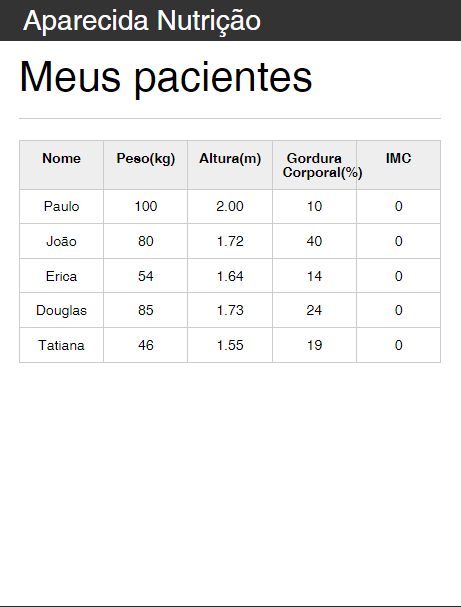

# Orgs

O site é um projeto desenvolvido no curso de javascript da Alura, que possibilita com que uma nutricionista gerencie as informações de seus pacientes

## 🔨 Funcionalidades do projeto

O projeto apresenta uma tabela simples de pacientes, onde é possível adicionar e remover os pacientes com suas respectivas informações.

## ✔️ Técnicas e tecnologias utilizadas

As técnicas e tecnologias utilizadas pra isso são:

- `Mobile first`: criação de projetos web e sites primeiro em dispositivos móveis
- `ConstraintLayout`: ViewGroup padrão para implementar todos os layouts
- `Coil`: carregar imagens via requisição HTTP
- `View Binding`: busca de views do layout de forma segura
- `Fontes personalizadas`: configuração para adicionar novas fontes
- `Personalização de tema`: modificação de cores para o tema do App
- `HTML`: Linguagem de Marcação de HiperTexto
- `CSS`: Cascading Style Sheets ou Folhas de Estilo em Cascata
- `JAVASCRPT`: uma linguagem de programação interpretada estruturada

## 🎯 Desafio

Tela de detalhes do produto

## 📁 Acesso ao projeto

Você pode [acessar o código fonte do projeto inicial](https://github.com/Joseulisses065/aparecida-nutricao)

## 🛠️ Abrir e rodar o projeto

No link abaixo você pode acessar meu portfólio:

[Acessar portfólio](LINK)